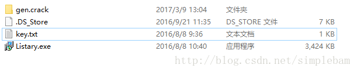
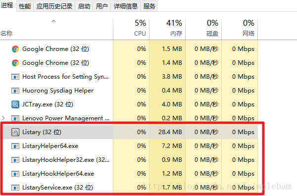
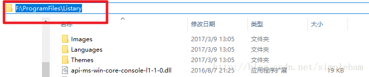
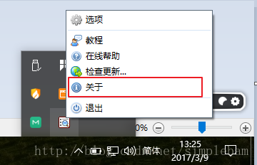
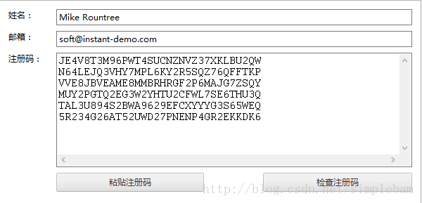
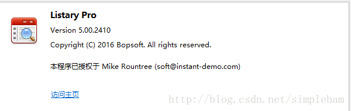
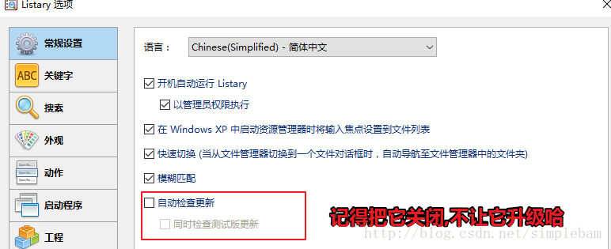

1.解压压缩文件,得到”Listary.Pro.5.00.2410.fix”文件夹,双击”Listry.exe”进行安装

2.安装完毕之后选择中文语言,之后完全退出软件(包括关闭进程里面的服务”ListaryService.exe(32位)”) 

PS:如果你不会的话,卸载该软件重启电脑重装,在安装的完成的最后一个界面”取消运行Listary”(即是取消选择上面的那个按钮或者点击界面右上角的”X”关闭按钮) 

3.打开”gen.crack”文件夹，将其中的”MSVCP140.dll”到你安装该软件的目录,比如(“F:\ProgramFiles\Listary”) 

4.打开桌面”Listary”,在桌面的右下角对其右键选择”关于”-“升级到Listary Pro”出现注册框 

5.打开”key.txt”,将相关信息对应输入第四部的注册框中完成注册;

    Name: Mike Rountree 
    Email: soft@instant-demo.com

    JE4V8T3M96PWT4SUCNZNVZ37XKLBU2QW 
    N64LEJQ3VHY7MPL6KY2R5SQZ76QFFTKP 
    VVE8JBVEAME8MMBRHRGF2P6MAJG7ZSQY 
    MUY2PGTQ2EG3W2YHTU2CFWL7SE6THU3Q 
    TAL3U894S2BWA9629EFCXYYYG3S65WEQ 
    5R234G26AT52UWD27PNENP4GR2EKKDK6

激活成功的标志: 

6.关闭升级(一定要记得关闭，因为这个破解补丁跟账号密码是针对这版本的，如果你更新了，那么破解就会失效啦) 

